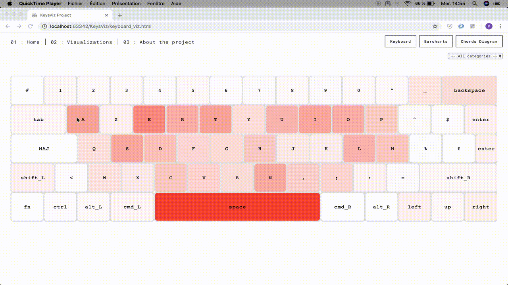
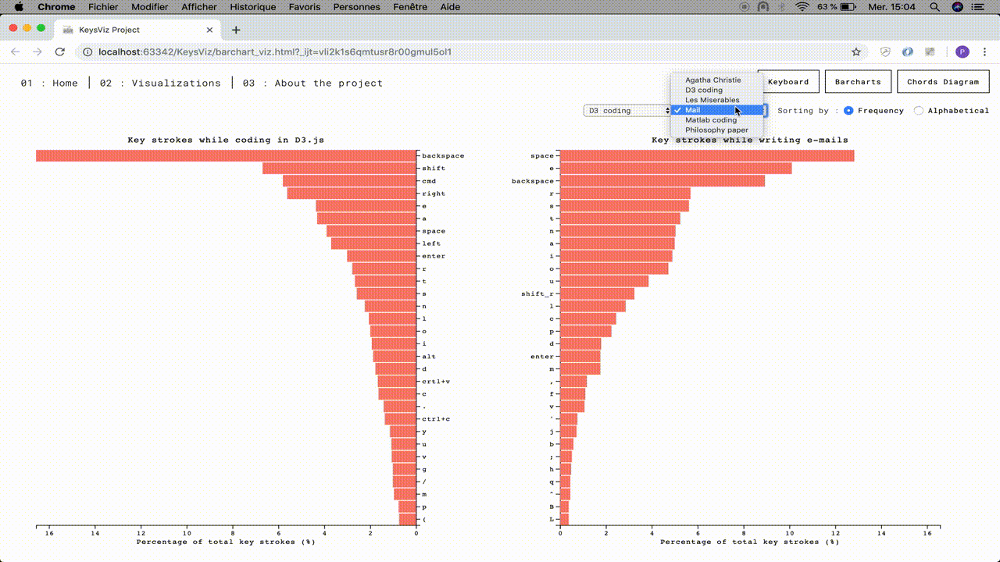
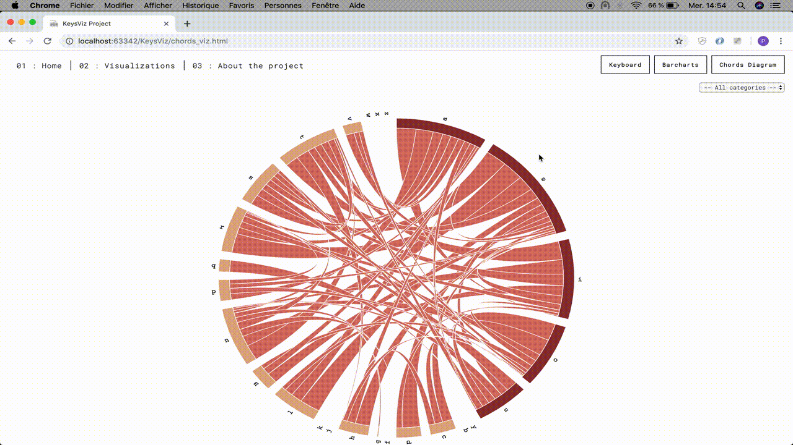

#KeysViz Project

This repository hosts the KeysViz project motivated by the [interactive data visualization class](https://github.com/LyonDataViz/MOS5.5-Dataviz) given by [Romain Vuillemot](https://github.com/romsson), during my last year at École Centrale de Lyon.

#Record your own keystrokes and analyze it

This project aims at creating different D3js visualizations showing insights from personal keyboard strokes data. For this purpose a keylogger has been implemented.

The project is available [here](https://tridet.github.io/KeysViz/index.html).

#Try it

#Authors

Loïc BETHENCOURT - Pascal GODBILLOT - Théo LACOUR

#Credits
